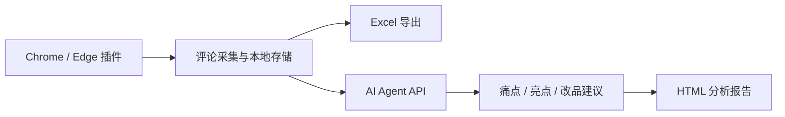

# 亚马逊竞品评论采集与分析插件方案

当前插件定位：采集亚马逊竞品公开评论，清洗为可翻译、可导出、可分析的数据表；后续接入 AI Agent，输出痛点、亮点、改品建议和 Listing 卖点。

## 当前版本

- 版本：`0.8.9`
- 更新日期：`2026-06-06`
- 形态：Chrome / Edge 本地未打包扩展
- 当前使用重点：以美国站采集为主，北美三站作为可选扩展能力
- 当前结论：采集、导出和 AI 报告 MVP 已完成；后续重点是继续优化报告质量和异常重试。
- 核心入口：
  - `popup.html`：插件弹窗
  - `popup.js`：导出、翻译、状态管理
  - `content.js`：页面评论采集
  - `manifest.json`：扩展配置

## 当前能力

| 模块 | 已支持 |
|---|---|
| 评论采集 | 按 ASIN 和站点打开评论页，慢速点击加载更多 |
| 多 ASIN | 支持一次输入多个 ASIN，按顺序自动采集 |
| 多站点 | 支持通过勾选框选择加拿大、美国、墨西哥任意组合，与 ASIN 组合成任务队列 |
| 站点 | 美国、加拿大、墨西哥（北美三站） |
| 进度 | 本地保存进度，刷新页面或关闭弹窗不丢失已采集评论 |
| 草稿保存 | 弹窗内未开始的 ASIN、站点和采集参数会自动保存，下次打开恢复 |
| 状态展示 | 支持运行中、已暂停、待导出 Excel、Excel 已导出、AI 生成中、AI 失败、AI 已完成等状态，展示当前 ASIN、站点、任务、批次、保存数、可导出数，并在等待加载时显示实时倒计时 |
| 登录态 | 真实站点模式，若某站点要求重新登录会自动暂停 |
| 去重 | 按评论 ID 或评论人/日期/正文合并 |
| 筛选 | 导出时固定只保留 Verified Purchase |
| 风控处理 | 检测验证码或访问限制后自动暂停 |
| 翻译 | 导出前翻译标题和正文为中文，翻译进度分段写回本地 |
| 两段式导出 | 采集完成后可独立导出 Excel，也可单独生成 / 下载 AI 报告，两者不互相作废 |
| Excel 导出 | 支持翻译并导出 `.xlsx`，带冻结表头、筛选、列宽、换行、可点击链接 |
| AI Agent 配置 | 支持选择 OpenAI / Claude，填写接口地址、模型和 API Key，配置保存在浏览器本地；内置默认分析提示词，并支持修改 |
| AI 分析报告 | 调用 OpenAI / Claude，生成痛点、亮点、使用场景、改品建议、Listing 卖点和证据评论 HTML 报告 |
| 稳定性 | 弹窗关键 UI 操作已做空值保护，降低旧页面缓存导致的空引用报错 |

## 最近更新

- 多站点任务队列已按 `ASIN × 站点` 顺序执行，不再只跑首个站点。
- 站点范围为北美三站：美国、加拿大、墨西哥。
- 扩展权限、弹窗入口和跳转域名已同步覆盖北美三站。
- 导出时会自动剔除非 Verified Purchase 评论，只保留已验证购买评论。
- 多站点任务会在同一浏览器会话里顺序推进；如果某个站点弹出重新登录页，会自动暂停等待处理。
- 站点选择已改为加拿大、美国、墨西哥三个勾选框，支持任意组合。
- 弹窗布局已精简：移除星级和日期筛选，只保留 ASIN、采集站点、等待时间和加载批次。
- 状态卡已改为结构化展示，并区分正常完成和暂停中断。
- 等待自动点击 `Show 10 more reviews` 时，状态卡会按秒显示剩余倒计时。
- 弹窗脚本已加空值保护，避免旧弹窗缓存或 DOM 不同步时触发 `Cannot set properties ... value` 类报错。
- 新增 `AI Agent` 配置卡片，支持 OpenAI / Claude 两种服务商，保存接口地址、模型、API Key 和分析提示词，并可测试连接；配置与采集数据分开存储。
- 新增弹窗草稿自动保存：临时输入 ASIN 后即使点击网页导致弹窗收起，再打开仍会恢复输入内容和采集参数。
- 导出已拆分为 `导出 Excel`、`生成 AI 报告`、`下载 AI 报告`：Excel 可先落地，也可在 AI 生成中重复导出，AI 报告作为独立分析步骤。
- Excel 导出会翻译并下载 `.xlsx`；翻译进度会分段写回本地，降低中途失败损失。
- AI 报告只在 Excel 导出后可生成；报告失败或超时后可重新生成，不影响已导出的 Excel。
- AI 分析接口如果返回网页而不是 JSON，会提示检查 API 根地址，降低 `Unexpected token '<'` 这类报错的理解成本。
- OpenAI 兼容接口支持自动探测 `/v1`：测试连接和导出分析都会尝试原地址与自动补 `/v1` 地址，成功后保存可用地址。
- 测试连接已改为真正调用一次 LLM，拿到模型回复后才算连接成功，不再只检查接口可达或模型列表。

## 进度台账

| 阶段 | 状态 | 当前结果 | 下一步 |
|---|---|---|---|
| 采集 MVP | 已完成 | 单 ASIN / 多 ASIN、单站点 / 多站点顺序采集，慢速加载，断点进度保存 | 继续实测不同 ASIN 和站点 |
| 导出 MVP | 已完成 | 采集结束后可独立导出 Excel，再单独生成 HTML AI 分析报告 | 继续检查真实导出数据质量 |
| 采集体验增强 | 部分完成 | 已完成结构化状态卡、倒计时、空引用兜底 | 翻译失败重试、状态原因细化 |
| AI Agent 接入 | 已完成 | 已完成 OpenAI / Claude 配置、测试连接、默认提示词、自定义提示词和分析请求封装 | 继续优化异常提示 |
| AI 分析报告 | 已完成 | 后台自动生成 HTML 报告，包含痛点、亮点、改品建议、证据评论 | 继续优化报告视觉和结论质量 |
| 多竞品对比 | 未开始 | 仅支持多 ASIN 数据采集和合并导出 | 按 ASIN / 站点分组做横向对比 |

## 剩余待实现

| 优先级 | 功能 | 说明 |
|---|---|---|
| P1 | 多 ASIN 横向对比 | 按 ASIN、站点聚合痛点、亮点、评分和评论量，输出竞品矩阵 |
| P1 | 翻译失败重试 | 导出时记录失败项，支持重试，减少翻译列空值 |
| P1 | 采集状态细化 | 把验证码、登录、按钮消失、页面结构变化、无新评论等状态做成更明确的标签或日志 |
| P1 | 报告质量增强 | 优化 HTML 版式、结论聚类、证据评论可读性 |
| P2 | 任务独立进度面板 | 大量 ASIN / 多站点任务时再做；当前状态卡已够日常验证 |
| 暂缓 | 星级 / 日期过滤 | 已从弹窗移除；后续如需要，优先放到 AI 分析报告侧，而不是采集导出主流程 |
| 暂缓 | 图片下载 | 当前只导出图片链接，不下载图片；保持轻量，降低风险和复杂度 |

## 导出字段

| 字段 | 含义 | 处理规则 |
|---|---|---|
| ASIN | 商品 ASIN | 原样导出 |
| 站点 | 采集站点 | 转为中文站点名 |
| 评论ID | 亚马逊评论 ID | 用于去重和定位 |
| 评论地区 | 评论日期文案里的地区 | 例如 `United States` |
| 原始评论日期 | 亚马逊页面原文日期 | 原样保留 |
| 评论日期 | 标准日期 | 转为 `YYYY-MM-DD`，无法识别时保留原文 |
| 原始评星 | 亚马逊页面原文评星 | 例如 `5.0 out of 5 stars` |
| 评星 | 数字评星 | 例如 `5.0` |
| 情绪 | 简单情绪标签 | 4-5 星正面，3 星中性，1-2 星负面 |
| 评论人 | 评论人昵称 | 页面可见文本 |
| 评论人主页 | 评论人资料页 | 页面有链接时导出 |
| 是否验证购买 | Verified Purchase | 统一为 `是` / `否` |
| Helpful数量 | 有帮助票数 | 无值导出 `0` |
| 是否有买家实拍 | 评论是否含图片 | `是` / `否` |
| 图片数量 | 评论图片数量 | 数字 |
| 图片链接 | 评论图片链接 | 尽量去掉缩略图尺寸参数 |
| 是否有视频 | 评论是否含视频 | `是` / `否` |
| 评论产品的属性 | 页面属性文本 | 例如 `Color: BlackSize: Medium` |
| 颜色 | 从属性中拆出的颜色 | 支持常见多语言标签 |
| 尺寸 | 从属性中拆出的尺寸 | 支持常见多语言标签 |
| 英文标题 | 评论标题原文 | 修复星级误识别为标题的问题 |
| 英文评论 | 评论正文原文 | 原样导出 |
| 标题中文翻译 | 标题中文翻译 | 翻译失败留空 |
| 评论中文翻译 | 正文中文翻译 | 翻译失败留空 |
| 评论链接 | 评论详情页 | 可点击跳转 |

## Excel 导出规范

| 项 | 规则 |
|---|---|
| 文件名 | `amazon-reviews-ASIN.xlsx` |
| Sheet | `评论数据` |
| 表头 | 冻结首行 |
| 筛选 | 首行自动筛选 |
| 列宽 | 按字段类型预设列宽 |
| 长文本 | 自动换行 |
| 日期 | `评论日期` 按 Excel 日期写入 |
| 数字 | `评星`、`Helpful数量`、`图片数量` 按数字写入 |
| 链接 | `评论人主页`、`图片链接`、`评论链接` 可点击 |

## 已做的重要优化

- 标题采集不再把 `5.0 out of 5 stars` 当作标题。
- 颜色和尺寸从属性文本中拆列。
- 评论日期从英文/多语言页面文案转为 `YYYY-MM-DD`。
- 评星从页面文案转为数字。
- Verified Purchase 统一为 `是` / `否`。
- Helpful 空值统一为 `0`。
- 图片链接只保留链接，不下载图片。
- 图片链接会尽量去掉 `._SY88`、`._SX88_`、`._SL1600_` 等缩略图参数。

## AI 实现设计

### AI Agent 接入

插件配置：

| 配置 | 含义 |
|---|---|
| 服务商 | OpenAI / Claude，已支持选择 |
| 接口地址 | OpenAI 默认 `https://api.openai.com/v1`；Claude 默认 `https://api.anthropic.com/v1` |
| 模型 | OpenAI 默认 `gpt-4o-mini`；Claude 默认 `claude-3-5-sonnet-latest` |
| API Key | 调用凭证，已支持填写、保存和测试 |
| 分析提示词 | 内置默认竞品评论分析提示词，支持手动修改和恢复默认 |
| 分析语言 | 内部默认中文，暂不暴露配置 |
| 每批评论数 | 内部默认处理，暂不暴露配置 |

当前导出入口：

- 采集全部完成后，可点击 `导出 Excel`，让评论数据落地
- 需要分析时，点击 `生成 AI 报告`
- AI 报告准备好后，点击 `下载 AI 报告`，ZIP 内只包含 HTML 分析报告

OpenAI 测试连接会真正调用一次模型：

```http
POST <接口地址>/chat/completions
Authorization: Bearer <API Key>
Content-Type: application/json
```

Claude 测试连接会真正调用一次模型：

```http
POST <接口地址>/messages
x-api-key: <API Key>
anthropic-version: 2023-06-01
Content-Type: application/json
```

测试请求会要求模型返回一个极小 JSON。只有接口返回 `2xx` 且模型实际返回内容时才视为连接成功；非 `2xx`、超时、未授权域名、模型不可用或无内容都会显示失败原因。

### AI 分析报告

Agent 返回结构建议：

```json
{
  "summary": "整体结论",
  "painPoints": [],
  "highlights": [],
  "improvements": [],
  "scenarios": [],
  "listingBullets": [],
  "risks": [],
  "evidence": []
}
```

报告栏目：

| 栏目 | 内容 |
|---|---|
| 数据概况 | ASIN、评论数、评分分布、时间范围 |
| 高频痛点 | 用户抱怨最多的问题 |
| 高频亮点 | 用户认可的功能和体验 |
| 用户场景 | 跑步、通勤、训练、多宠物等场景 |
| 改品建议 | 可落地的结构、材料、配件、包装改进 |
| Listing 卖点 | 可用于标题、五点、A+ 的表达 |
| 风险提醒 | 品类雷区、合规风险、差评高发点 |
| 证据评论 | 每个结论对应的评论原文或链接 |

### 多竞品对比

| 能力 | 输出 |
|---|---|
| 多 ASIN 合并分析 | 品类级痛点和亮点 |
| 竞品矩阵 | 每个 ASIN 的优势、短板、价格/评分/评论量 |
| 差评聚类 | 哪些问题是品类共性，哪些是单品问题 |
| 改品优先级 | 高 / 中 / 低 |
| 新品机会点 | 可差异化切入的功能和卖点 |

## 推荐架构



| 组件 | 职责 |
|---|---|
| 浏览器插件 | 采集评论、清洗字段、导出数据、调用 Agent |
| Agent 服务 | 保存真正的大模型 Key，执行分析和报告生成 |
| Codex Skill | 沉淀分析模板、字段解释、报告规则 |
| Excel / HTML | 数据留档、人工筛选和分析报告 |

## API 设计草案

请求：

```json
{
  "projectName": "免提狗绳竞品分析",
  "site": "US",
  "asins": ["B07XXXXXXX"],
  "reviews": [
    {
      "asin": "B07XXXXXXX",
      "rating": "5.0",
      "date": "2026-05-07",
      "verified": "是",
      "helpfulCount": "12",
      "title": "Excellent",
      "body": "Original review text",
      "bodyZh": "中文翻译",
      "url": "https://..."
    }
  ]
}
```

响应：

```json
{
  "summary": "该竞品核心优势是弹力缓冲和腰带免提，主要短板是收纳袋容量。",
  "painPoints": [
    {
      "name": "收纳袋偏小",
      "frequency": 8,
      "severity": "中",
      "evidenceReviewIds": ["R123"]
    }
  ],
  "highlights": [],
  "improvements": [],
  "listingBullets": [],
  "evidence": []
}
```

## 安全和边界

- 插件不会绕过验证码、登录验证或访问限制。
- 降低采集速度不能保证账号不受限制。
- 图片只导出链接，不自动下载。
- 买家图片和评论仅建议用于内部选品、竞品和改品分析。
- 插件内保存官方模型 API Key 适合个人自用；团队或公开分发建议通过服务端 Agent 中转。
- 使用者需要自行确认使用方式符合亚马逊条款和所在地法律。
